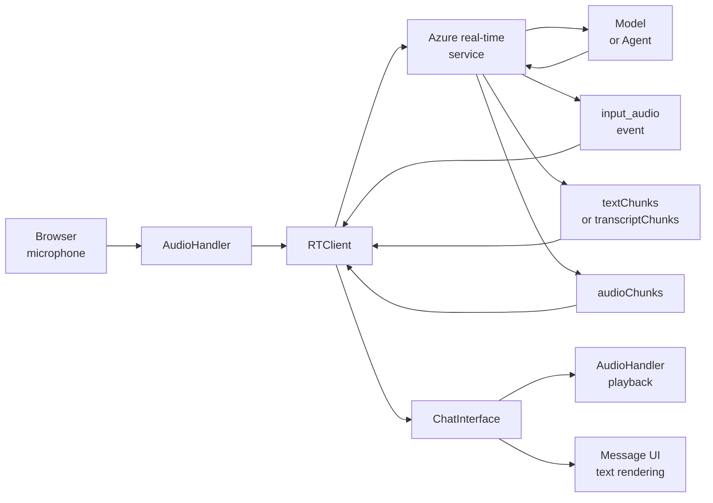
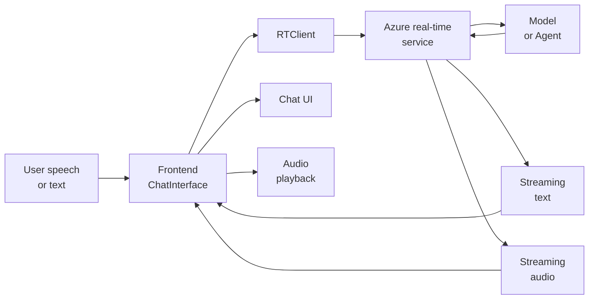
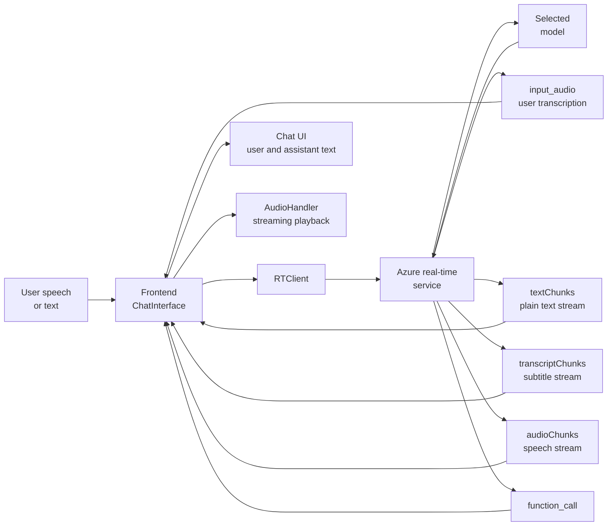
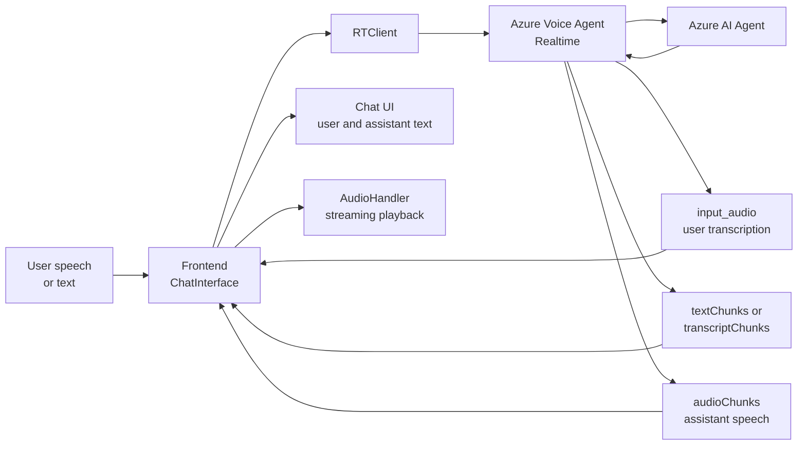

# Architecture Overview

This document explains the overall architecture of the Voice Live Agent Sample and describes how `model` mode and `agent` mode work.

## 1. Goal of the project

This project is a Next.js real-time voice conversation frontend. You use it to:

- establish a browser session with Azure real-time services
- capture microphone audio and stream it to the service
- receive streaming text and audio responses
- play assistant speech in the browser
- optionally render an Avatar video stream
- integrate local function tools and Azure AI Search in `model` mode
- connect to Azure AI Agent Service in `agent` mode

## 2. Core directory structure

```text
src/
  app/
    page.tsx
    chat-interface.tsx
    layout.tsx
    globals.css
    index.css
    svg.tsx
  components/ui/
    accordion.tsx
    button.tsx
    input.tsx
    select.tsx
    slider.tsx
    switch.tsx
  lib/
    audio.ts
    proactive-event-manager.ts
    utils.ts
public/
  audio-processor.js
```

## 3. Responsibilities of core components

### 3.1 `ChatInterface`

`ChatInterface` is the main controller. It:

- keeps connection, recording, message, and configuration state
- creates `RTClient`
- connects either a model or an Agent depending on the selected mode
- sends voice, transcription, tool, and Avatar settings through `configure()`
- listens to server events and updates the UI

### 3.2 `AudioHandler`

`AudioHandler` handles local audio processing. It:

- captures microphone audio in the browser
- converts `Float32` audio to `Int16` / `Uint8Array`
- plays streaming audio chunks from the service
- records a stereo conversation timeline for download
- drives recording and playback animations

### 3.3 `ProactiveEventManager`

`ProactiveEventManager` handles proactive conversation behavior. It:

- sends a greeting when the session starts
- triggers a follow-up when the user stays inactive

### 3.4 `rt-client`

`rt-client` is the Azure real-time client library. It:

- opens the WebSocket connection
- sends audio and conversation items
- receives input audio events and response events
- exposes streaming APIs such as `audioChunks()`, `textChunks()`, and `transcriptChunks()`

## 4. End-to-end architecture

### 4.1 Shared session flow



### 4.2 Simplified interaction diagram



This simplified diagram highlights only the main interaction path:

- the user sends speech or text to the frontend
- the frontend sends data through `RTClient`
- Azure routes the request to a model or an Agent
- the backend returns streaming text and streaming audio
- the frontend renders text and plays audio

### 4.3 Shared execution steps

1. You choose the mode, voice, transcription, turn detection, and other settings.
2. The frontend creates `RTClient` and connects to the Azure real-time service.
3. The frontend calls `configure()` to send session parameters.
4. The browser starts recording and streams audio chunks to the service.
5. The service returns input transcription events and assistant response events.
6. The frontend receives `input_audio` events and shows user transcription.
7. The frontend receives assistant-side text and audio streams.
8. The frontend renders the text stream and passes audio chunks to `AudioHandler`.
9. If you enable Avatar, the frontend also creates a WebRTC media connection.

### 4.4 Types of streams returned by the backend

The backend does not return a single complete message only once. It returns event streams and content streams, mainly:

- `input_audio` events for user speech transcription
- `response` events for assistant output
- `textChunks()` for incremental plain-text output
- `transcriptChunks()` for subtitle text paired with audio output
- `audioChunks()` for streaming audio output

The frontend consumes these streams in parallel. As a result, you can observe:

- user transcription appearing as input completes
- assistant text appearing incrementally
- assistant speech being played chunk by chunk

## 5. `model` mode architecture

### 5.1 Purpose of `model` mode

In `model` mode, you connect directly to a real-time model or a cascaded model. The frontend manages tools, search, and part of the orchestration.

### 5.2 Connection target in `model` mode

The frontend sets `modelOrAgent` to a model name such as:

- `gpt-4o-realtime-preview`
- `gpt-4o-mini-realtime-preview`
- `gpt-realtime-1.5`
- `gpt-4.1`
- `gpt-4o`

### 5.3 Data flow in `model` mode



### 5.4 Characteristics of `model` mode

- You choose the model directly.
- You can send `instructions` from the frontend.
- You can enable proactive responses.
- You can enable local `function` tools.
- You can integrate Azure AI Search as a tool backend.

### 5.5 Stream behavior returned in `model` mode

In `model` mode, the backend can return the following stream patterns:

1. `input_audio` events
  - These indicate that user audio has been transcribed on the service side.
  - The frontend uses `item.transcription` to update the user message.

2. Plain text streams
  - `content.type === "text"`
  - The frontend consumes `textChunks()` incrementally.

3. Audio streams
  - `content.type === "audio"`
  - The frontend consumes `transcriptChunks()` for subtitles.
  - The frontend consumes `audioChunks()` for playback.

4. Function call streams
  - The model can emit `function_call` items.
  - The frontend runs the tool and returns the result.

This means a `model` mode response can be:

- text only
- text plus function calls
- audio plus subtitle text
- a mix of text, audio, and function calls

### 5.6 Tool system in `model` mode

In `model` mode, the frontend registers and executes tools.

The built-in tool definitions are:

- `search`
- `get_time`
- `get_weather`
- `calculate`

At the moment, only these tools are both enabled and implemented:

- `search`
- `get_time`

The tool flow is:

1. The frontend passes `tools` into `configure()`.
2. The model decides whether it wants to emit a `function_call`.
3. The frontend receives the `function_call` event.
4. The frontend runs the tool locally.
5. The frontend sends the result back as `function_call_output`.
6. The model continues the response with the tool result.

### 5.7 Azure AI Search in `model` mode

Azure AI Search is used only in `model` mode. The flow is:

1. You enable the `Search` tool.
2. You enter the Search endpoint, index, key, and field names.
3. The frontend creates `SearchClient`.
4. The model triggers `search(query)`.
5. The frontend queries Azure AI Search.
6. The frontend sends the search result back to the model.

## 6. `agent` mode architecture

### 6.1 Purpose of `agent` mode

In `agent` mode, you connect to an Agent that already exists in Azure AI Agent Service. The Agent owns knowledge, actions, and backend orchestration. The frontend mainly provides voice input and presentation.

### 6.2 Connection target in `agent` mode

The frontend sets `modelOrAgent` to an Agent configuration object that includes:

- `agentId`
- `projectName`
- `agentAccessToken`

### 6.3 Data flow in `agent` mode



### 6.4 Characteristics of `agent` mode

- You do not choose a model directly.
- You must provide Agent-specific connection values.
- You must use an Entra token for authentication.
- You cannot pass local `function` tools to the Agent.
- You depend on the Agent for knowledge, actions, and orchestration.

### 6.5 Stream behavior returned in `agent` mode

In `agent` mode, the backend stream mainly focuses on user transcription and final assistant output, not on frontend-owned local tool execution. The stream usually contains:

1. `input_audio` events
  - These indicate that user speech transcription is complete on the service side.

2. Assistant text streams
  - These can come from `textChunks()`.
  - They can also come from `transcriptChunks()` inside audio content.

3. Assistant audio streams
  - The frontend plays `audioChunks()` progressively.

Unlike `model` mode, `agent` mode should not rely on frontend-owned local `function` tool loops. Agent-side tools and knowledge calls are handled inside Azure AI Agent, while the frontend mainly consumes the resulting text and audio streams.

### 6.6 Configuration requirements in `agent` mode

You must provide these values:

- Azure AI Services / Foundry resource endpoint
- Entra token
- Agent Project Name
- Agent ID

Use a resource endpoint in this format:

```text
https://<resource-name>.cognitiveservices.azure.com/
```

Do not use an Azure OpenAI endpoint in this format:

```text
https://<project-or-openai-resource>.openai.azure.com/
```

### 6.7 Tool restriction in `agent` mode

The AI Agent accepts `mcp` tools, not the local `function` tools that this project uses in `model` mode.

For that reason, this project does the following when you switch to `agent` mode:

- clears local `tools`
- disables local Search configuration
- stops passing local `function` tools into `configure()`

## 7. Speech input and speech output

### 7.1 Input side

The frontend handles these tasks locally:

- capture microphone audio
- convert the audio format
- stream audio chunks to the service

Azure handles these tasks on the service side:

- speech transcription
- turn detection
- the server-side part of noise reduction and echo cancellation

### 7.2 Output side

Azure generates spoken output according to the `voice` configuration. The frontend handles:

- receiving `audioChunks()`
- playing audio in a streaming way
- showing synchronized transcript and text content

### 7.3 Text and audio streams

You receive two output categories:

- text chunks
- audio chunks

More precisely, the frontend sees three incremental content forms that affect the UI:

- `textChunks()` for plain text output
- `transcriptChunks()` for subtitle text paired with audio output
- `audioChunks()` for playable audio output

These all arrive as streams. The frontend consumes text and audio in parallel, so the user experience is typically:

- text appears progressively
- speech plays while it is still arriving
- user transcription appears before or alongside the assistant response

## 8. Avatar architecture

If you enable Avatar, the project adds a WebRTC media path.

### 8.1 Responsibility split

- WebSocket / `RTClient`: real-time messages, audio, and control signals
- WebRTC: Avatar audio and video media streams

### 8.2 Execution flow

1. The frontend calls `configure()` and receives Avatar configuration and ICE information.
2. The frontend creates `RTCPeerConnection`.
3. The frontend exchanges SDP through `connectAvatar()`.
4. The service pushes audio and video tracks to the page.

## 9. Frontend UI layers

### 9.1 Settings panel

The left settings panel lets you configure:

- mode selection
- connection values
- conversation settings
- tools and Search
- voice and Avatar

### 9.2 Chat area

The right chat area shows:

- user messages
- assistant messages
- status and error messages

### 9.3 Developer mode

`Developer mode` only changes the UI and interaction style. It does not change the session protocol.

When you enable it, you can:

- keep the chat panel visible after connection
- send manual text messages
- debug message flow more easily

When you disable it, the page behaves more like an end-user voice and Avatar experience.

## 10. Comparison of the two modes

| Dimension | `model` mode | `agent` mode |
| --- | --- | --- |
| Connection target | Direct model connection | Azure AI Agent connection |
| Main configuration | Model name | Project Name + Agent ID + Token |
| Authentication | API key or token | Entra token |
| Tool execution | Frontend executes local `function` tools | Agent side manages tools, frontend does not pass local `function` tools |
| Search integration | Frontend calls Azure AI Search directly | Depends on the Agent implementation |
| Instruction source | Frontend `instructions` | Agent definition and Agent-side configuration |
| Orchestration | Frontend + model | Agent service |
| Best fit | Fast experiments, model debugging, frontend-owned orchestration | Enterprise knowledge, actions, and Agent integration |

## 11. Recommended usage

### 11.1 When you should choose `model` mode

Choose `model` mode when you need to:

- test real-time models quickly
- validate speech input and output behavior directly
- integrate Search and local tools in the frontend
- iterate on prompts and voice settings

### 11.2 When you should choose `agent` mode

Choose `agent` mode when you need to:

- connect to Azure AI Agent Service
- reuse Agent knowledge and actions
- route voice input to an enterprise Agent
- centralize orchestration on the backend

## 12. Summary

This project uses a browser voice frontend plus Azure real-time services.

- In `model` mode, the frontend connects directly to a model and owns local tools and Search integration.
- In `agent` mode, the frontend connects to Azure AI Agent and mainly provides voice entry and UI presentation.
- Both modes share the same audio capture, audio playback, message rendering, and Avatar rendering foundation.

If you want to extend the project, decide first whether the frontend or the Agent should own orchestration. Then choose the mode that matches that responsibility split.
