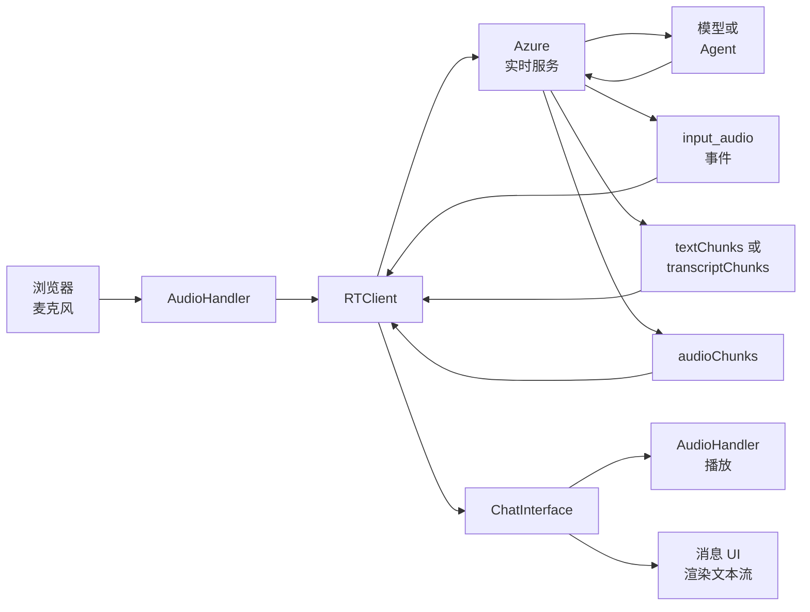
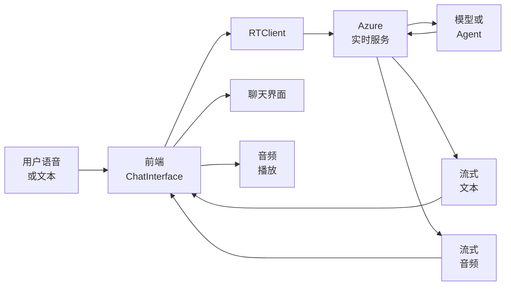
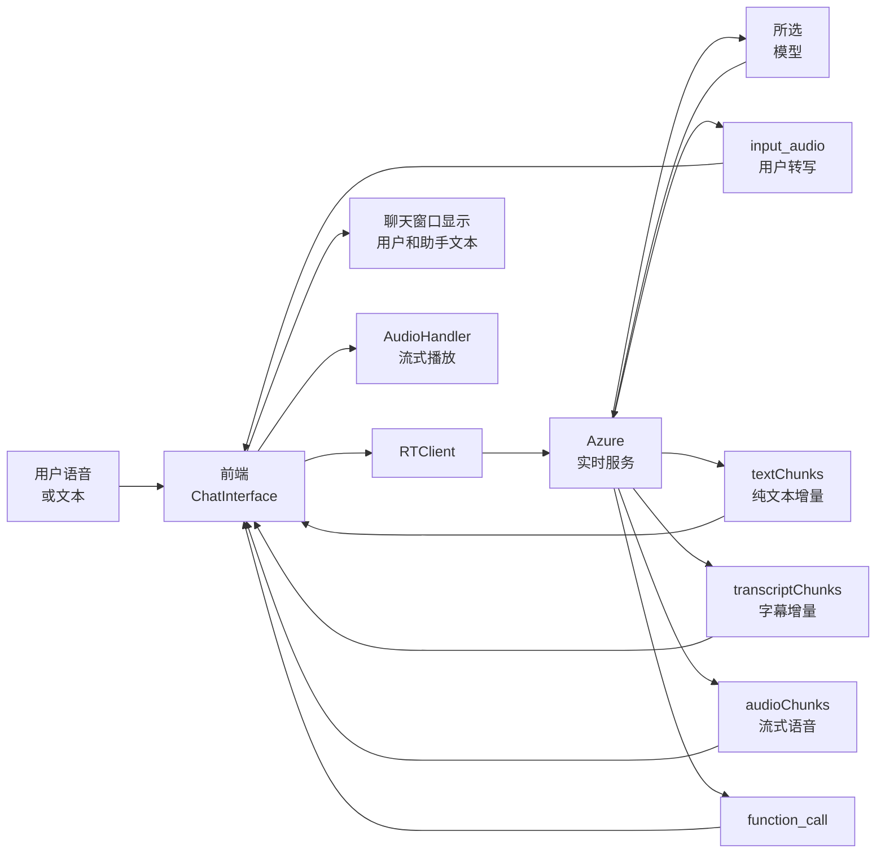
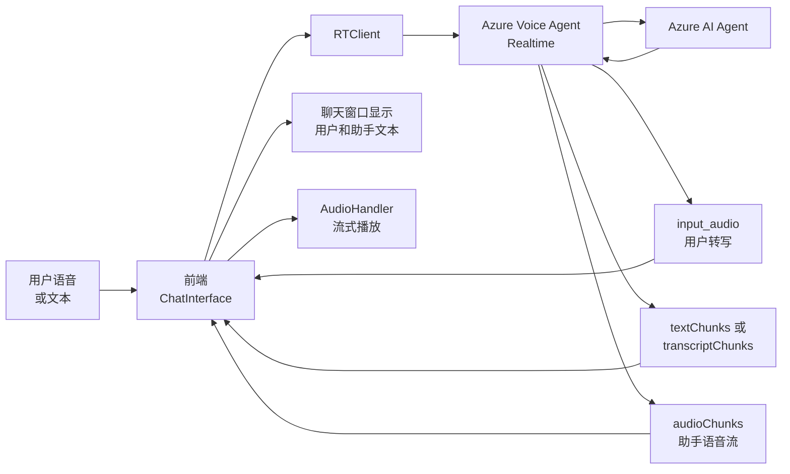

# 工程架构总览

本文档介绍 Voice Live Agent Sample 的整体架构，并分别说明 `model` 模式和 `agent` 模式的运行方式。

## 1. 工程目标

这个工程是一个基于 Next.js 的实时语音对话前端。你可以用它完成以下任务：

- 建立浏览器到 Azure 实时服务的会话
- 采集麦克风音频并持续上传
- 接收文本流和音频流
- 播放语音回复
- 可选地展示 Avatar 视频流
- 在 `model` 模式下接入本地函数工具和 Azure AI Search
- 在 `agent` 模式下连接 Azure AI Agent Service

## 2. 核心目录结构

```text
src/
  app/
    page.tsx
    chat-interface.tsx
    layout.tsx
    globals.css
    index.css
    svg.tsx
  components/ui/
    accordion.tsx
    button.tsx
    input.tsx
    select.tsx
    slider.tsx
    switch.tsx
  lib/
    audio.ts
    proactive-event-manager.ts
    utils.ts
public/
  audio-processor.js
```

## 3. 核心组件职责

### 3.1 `ChatInterface`

`ChatInterface` 是主控制器。它负责：

- 维护连接状态、录音状态、消息状态和配置状态
- 创建 `RTClient`
- 根据模式决定连接模型还是 Agent
- 调用 `configure()` 下发语音、转写、工具和 Avatar 配置
- 监听服务端事件并更新 UI

### 3.2 `AudioHandler`

`AudioHandler` 负责本地音频处理。它负责：

- 从浏览器麦克风采集音频
- 把 `Float32` 音频转换为 `Int16` / `Uint8Array`
- 按流式方式播放服务端返回的音频块
- 记录双声道会话时间线，支持下载录音
- 驱动录音和播放动画

### 3.3 `ProactiveEventManager`

`ProactiveEventManager` 负责主动交互逻辑。它负责：

- 会话开始时触发欢迎语
- 用户长时间无活动时触发跟进消息

### 3.4 `rt-client`

`rt-client` 是连接 Azure 实时服务的客户端库。它负责：

- 建立 WebSocket 连接
- 发送音频和消息项
- 接收输入音频事件和响应事件
- 提供 `audioChunks()`、`textChunks()`、`transcriptChunks()` 等流式接口

## 4. 整体运行链路

### 4.1 通用语音会话链路



### 4.2 简化版交互图



这张简化图只保留主链路，方便快速说明：

- 用户把语音或文本发给前端
- 前端通过 `RTClient` 把请求送到 Azure
- Azure 把请求交给模型或 Agent
- 后台返回流式文本和流式音频
- 前端负责显示文本并播放音频

### 4.3 通用阶段说明

1. 你在页面中选择模式、声音、转写、Turn Detection 和其他参数。
2. 前端创建 `RTClient` 并连接 Azure 实时服务。
3. 前端调用 `configure()` 下发会话参数。
4. 浏览器开始录音，并把音频块持续发送到服务端。
5. 服务端返回输入转写事件和助手响应事件。
6. 前端接收 `input_audio` 事件，并显示用户输入转写。
7. 前端接收助手侧的文本流和音频流。
8. 前端把文本流显示到消息区，并把音频块交给 `AudioHandler` 播放。
9. 如果启用 Avatar，前端额外建立 WebRTC 媒体链路。

### 4.4 服务端返回流的类型

后台返回并不是一次性完整消息，而是事件流和内容流。主要包括：

- `input_audio` 事件：包含用户语音的转写结果
- `response` 事件：包含助手响应
- `textChunks()`：纯文本输出的增量文本块
- `transcriptChunks()`：音频输出对应的字幕文本块
- `audioChunks()`：流式音频块

前端会并行消费这些流，因此你会同时看到：

- 用户输入转写逐步完成
- 助手文本逐步显示
- 助手语音逐块播放

## 5. `model` 模式架构

### 5.1 `model` 模式的目标

在 `model` 模式下，你直接连接某个实时模型或级联模型。前端自己管理工具、搜索和部分交互编排。

### 5.2 `model` 模式连接对象

前端把 `modelOrAgent` 设置为模型名，例如：

- `gpt-4o-realtime-preview`
- `gpt-4o-mini-realtime-preview`
- `gpt-realtime-1.5`
- `gpt-4.1`
- `gpt-4o`

### 5.3 `model` 模式数据流



### 5.4 `model` 模式特点

- 你可以直接选择模型。
- 你可以输入 `instructions` 来控制模型行为。
- 你可以启用 proactive responses。
- 你可以启用本地 `function` 类型工具。
- 你可以接入 Azure AI Search 作为工具后端。

### 5.5 `model` 模式下后台返回的流特征

`model` 模式下，后台可能返回以下组合：

1. `input_audio` 事件
  - 表示用户输入音频已经完成服务端转写
  - 前端使用 `item.transcription` 更新用户消息

2. 纯文本流
  - `content.type === "text"`
  - 前端通过 `textChunks()` 逐步显示文本

3. 音频流
  - `content.type === "audio"`
  - 前端通过 `transcriptChunks()` 读取字幕
  - 前端通过 `audioChunks()` 读取可播放音频块

4. 函数调用流
  - 模型可发起 `function_call`
  - 前端执行工具后把结果回传

这意味着 `model` 模式的响应可能是：

- 仅文本流
- 文本流加函数调用
- 音频流加字幕流
- 文本流、音频流、函数调用混合出现

### 5.6 `model` 模式工具系统

`model` 模式下，工具由前端注册并执行。

当前内置工具包括：

- `search`
- `get_time`
- `get_weather`
- `calculate`

其中当前真正启用并实现的只有：

- `search`
- `get_time`

工具调用流程如下：

1. 前端把 `tools` 定义传入 `configure()`。
2. 模型决定是否发起 `function_call`。
3. 前端接收 `function_call` 事件。
4. 前端本地执行工具逻辑。
5. 前端通过 `function_call_output` 把结果送回会话。
6. 模型基于工具结果继续生成回复。

### 5.7 `model` 模式中的 Azure AI Search

Azure AI Search 只在 `model` 模式下使用。流程如下：

1. 你勾选 `Search` 工具。
2. 你填写 Search Endpoint、Index、Key 和字段名。
3. 前端创建 `SearchClient`。
4. 模型触发 `search(query)`。
5. 前端查询 Azure AI Search。
6. 前端把检索结果回传给模型。

## 6. `agent` 模式架构

### 6.1 `agent` 模式的目标

在 `agent` 模式下，你连接 Azure AI Agent Service 中已创建的 Agent。Agent 负责知识、动作和后端编排，前端主要负责语音入口和展示。

### 6.2 `agent` 模式连接对象

前端把 `modelOrAgent` 设置为 Agent 配置对象，其中包括：

- `agentId`
- `projectName`
- `agentAccessToken`

### 6.3 `agent` 模式数据流



### 6.4 `agent` 模式特点

- 你不直接选择模型。
- 你需要填写 Agent 相关参数。
- 你需要使用 Entra token 进行身份验证。
- 你不能向 AI Agent 传本地 `function` 工具。
- 你依赖 Azure AI Agent 自身的知识、工具和动作能力。

### 6.5 `agent` 模式下后台返回的流特征

`agent` 模式下，后台返回的流重点是语音和文本结果，而不是前端本地工具调用。通常包括：

1. `input_audio` 事件
  - 表示用户语音已经完成服务端转写

2. 助手文本流
  - 可能来自 `textChunks()`
  - 也可能来自音频内容里的 `transcriptChunks()`

3. 助手音频流
  - 前端通过 `audioChunks()` 逐块播放

与 `model` 模式不同的是，`agent` 模式不应再由前端接管本地 `function` 工具闭环。Agent 侧工具和知识调用由 Azure AI Agent 自己处理，前端主要消费最终的文本流和音频流。

### 6.6 `agent` 模式配置要求

你需要填写以下字段：

- Azure AI Services / Foundry resource endpoint
- Entra token
- Agent Project Name
- Agent ID

你应使用如下形式的 resource endpoint：

```text
https://<resource-name>.cognitiveservices.azure.com/
```

你不应使用如下形式的 Azure OpenAI endpoint：

```text
https://<project-or-openai-resource>.openai.azure.com/
```

### 6.7 `agent` 模式工具限制

AI Agent 当前只接受 `mcp` 类型工具，不接受这个工程在 `model` 模式下使用的本地 `function` 类型工具。

因此，这个工程在切换到 `agent` 模式时会：

- 清空本地 `tools`
- 禁用本地 Search 配置
- 不再向 `configure()` 传 `function` tools

## 7. 语音输入与语音输出

### 7.1 输入侧

前端本地完成以下工作：

- 采集麦克风音频
- 转换音频格式
- 发送音频块到实时服务

Azure 侧完成以下工作：

- 输入语音转写
- Turn Detection
- 噪声抑制和回声消除的服务端部分处理

### 7.2 输出侧

Azure 侧根据 `voice` 配置生成语音输出。前端本地完成以下工作：

- 接收 `audioChunks()`
- 流式播放音频
- 同步显示字幕和文本内容

### 7.3 文本与音频流

你会收到两类输出：

- 文本块
- 音频块

更准确地说，前端会看到三类和显示有关的增量内容：

- `textChunks()`：纯文本内容流
- `transcriptChunks()`：音频内容对应的字幕流
- `audioChunks()`：可播放音频流

这些数据都以流式方式到达。前端会并行消费文本和音频流，因此用户常见体验是：

- 文字逐字或逐段出现
- 语音一边返回一边播放
- 用户输入转写先于或并行于助手回复出现

## 8. Avatar 架构

如果你启用 Avatar，工程会增加一条 WebRTC 媒体链路。

### 8.1 职责分工

- WebSocket / RTClient：负责实时消息、音频和控制信令
- WebRTC：负责 Avatar 音视频媒体流

### 8.2 链路说明

1. 前端先通过 `configure()` 获取 Avatar 配置和 ICE 信息。
2. 前端创建 `RTCPeerConnection`。
3. 前端通过 `connectAvatar()` 完成 SDP 交换。
4. 服务端把音视频轨道推送到页面。

## 9. 前端 UI 分层

### 9.1 设置面板

左侧设置面板负责：

- 模式切换
- 连接参数配置
- Conversation Settings 配置
- 工具和 Search 配置
- 语音和 Avatar 配置

### 9.2 聊天区域

右侧聊天区域负责：

- 展示用户消息
- 展示助手消息
- 展示状态和错误信息

### 9.3 Developer mode

`Developer mode` 只切换 UI 和交互方式。它不会改变会话协议。

开启后，你可以：

- 在连接后仍保留聊天面板
- 手动输入文本消息
- 更方便地调试消息流

关闭后，界面更偏面向终端用户的语音和 Avatar 展示模式。

## 10. 两种模式的对比

| 维度 | `model` 模式 | `agent` 模式 |
| --- | --- | --- |
| 连接对象 | 直接连接模型 | 连接 Azure AI Agent |
| 核心配置 | 模型名 | Project Name + Agent ID + Token |
| 认证方式 | API Key 或 Token | Entra Token |
| 工具执行 | 前端本地执行 `function` tools | Agent 侧管理，前端不传本地 `function` tools |
| Search 使用方式 | 前端直连 Azure AI Search | 由 Agent 自身能力决定 |
| 指令来源 | 前端 `instructions` | Agent 定义和 Agent 侧配置 |
| 编排位置 | 前端 + 模型 | Agent 服务侧 |
| 适用场景 | 快速实验、模型调试、前端主导编排 | 企业知识库、动作编排、Agent 集成 |

## 11. 推荐使用方式

### 11.1 你应选择 `model` 模式的情况

当你需要以下能力时，选择 `model` 模式：

- 快速测试实时模型
- 直接验证语音输入输出体验
- 在前端接入 Search 和本地工具
- 迭代 prompt 和 voice 配置

### 11.2 你应选择 `agent` 模式的情况

当你需要以下能力时，选择 `agent` 模式：

- 接入 Azure AI Agent Service
- 复用 Agent 的知识和动作
- 把语音入口接到企业 Agent
- 让后端统一管理业务编排

## 12. 总结

这个工程采用“浏览器语音前端 + Azure 实时服务”的整体结构。

- 在 `model` 模式下，前端直接连接模型，并负责本地工具和 Search 集成。
- 在 `agent` 模式下，前端连接 Azure AI Agent，主要承担语音入口和展示职责。
- 两种模式共享同一套音频采集、音频播放、消息展示和 Avatar 渲染基础设施。

如果你要扩展这个工程，建议你先确定是由前端主导编排，还是由 Agent 主导编排，再决定使用哪种模式。
